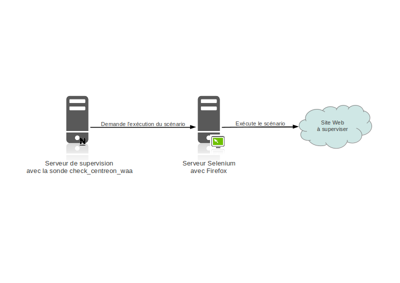

How it works
============

Centreon Waa uses a second server on which the Selenium server and the Firefox browser are running.

When a check is executed, there are three steps:

* Nagios executes the check_centreon_waa plugin
* This check connects to the Selenium server and asks for scenario actions
* The Selenium server executes the actions within a Firefox

How selenium works is described `here <http://docs.seleniumhq.org/docs/05_selenium_rc.jsp#how-selenium-rc-works>`_.
