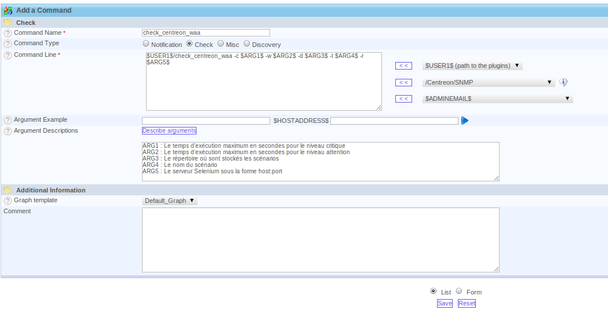
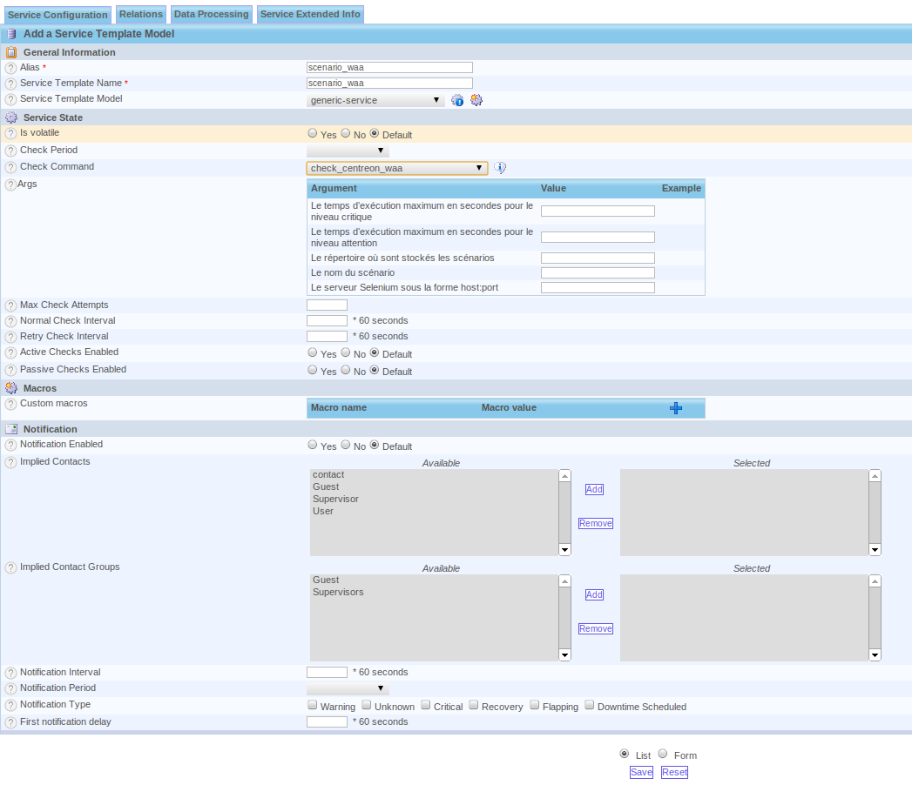
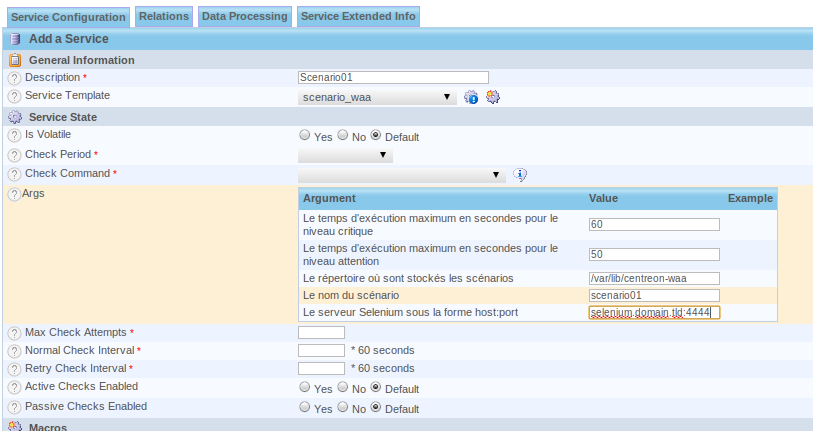

Check configuration
-------------------

This part describes the configuration of the Centreon Web.

Command configuration
~~~~~~~~~~~~~~~~~~~~~

The command is configured in the "Configuration > Commands > Checks".
To add a new command, click on the *Add* link.

We complete the form with the following information:

* Command Name : check_centreon_waa : The commmand name for Centreon
* Command Type : check : The type of this command
* Command Line : $USER1$/check_centreon_waa -c $ARG1$ -w $ARG2$ -d $ARG3$ -t $ARG4$ -r $ARG5$ : The command line will be executed by Nagios
* Graph Template : Default Graph
* Arguments Description

  - ARG1 : The execution time for be critical
  - ARG2 : The execution time for be warning
  - ARG3 : The scenarios directory
  - ARG4 : The scenario name
  - ARG5 : The Selenium server with format server:port

Service template configuration
~~~~~~~~~~~~~~~~~~~~~~~~~~~~~~

To facilitate the service configuration, we configure a service template.

The service template is configured in the "Configuration > Services > Templates"
To add a new service template, click on the *Add* link.

We complete the form with the following information:

* Alias : scenario_waa
* Service Template Name : scenario_waa
* Template Service Model : generic-service
* Check Command : check_centreon_waa

Service configuration
~~~~~~~~~~~~~~~~~~~~~

The service is configured in the "Configuration > Services > Service by hosts"
To add a new service, click on the *Add* link.

We complete the form with the following information:

* Description : Scenario01 : The service name
* Service template : scenario_waa
* Args : The command arguments

  - ARG1 : Example 60 (in seconds)
  - ARG2 : Example 50 (in seconds)
  - ARG3 : Example /var/lib/centreon_waa
  - ARG4 : Example scenario01
  - ARG5 : Example selenium.domain.tld:4444

