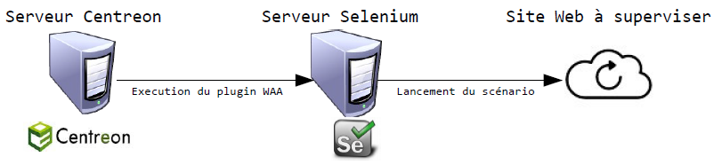

Fonctionnement
==============

Le plugin Centreon WAA permet d'exécuter à distance des scenarios Web en 
utilisant les fonctionnalités d'un serveur Selenium et d'un navigateur Firefox.

Un contrôle est exécuté, trois étapes sont réalisées :

* Centreon Engine exécute la sonde check_centreon_waa
* La sonde effectue une connexion au serveur Selenium en spécifiant le scénario à réaliser
* Le serveur Selenium exécute le scénario spécifié et renvoie le résultat (temps d'exécution, nombres d'étapes réussies / nombres d'étapes totales).

Une explication détaillée du fonctionnement de Selenium est disponible `ici <http://docs.seleniumhq.org/docs/05_selenium_rc.jsp#how-selenium-rc-works>`_.
