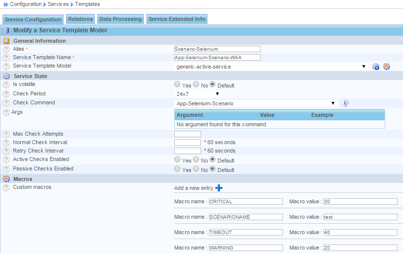
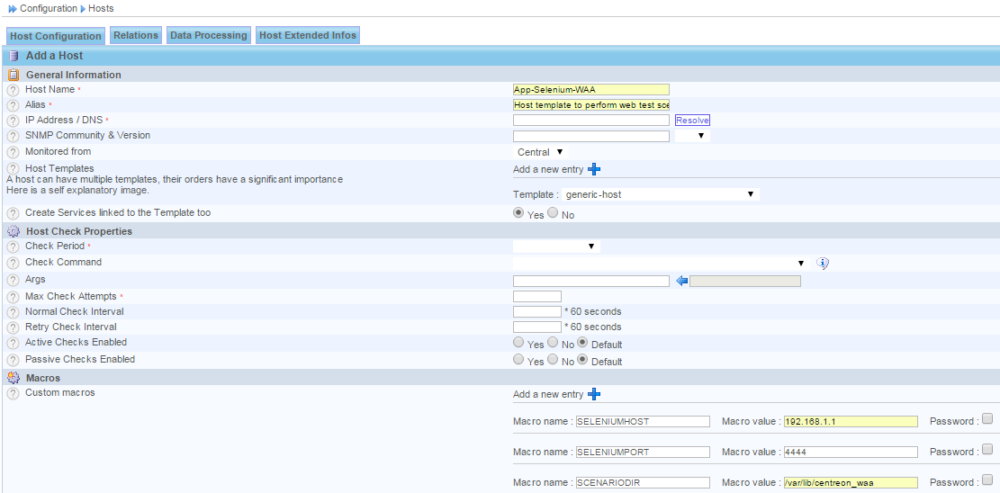

Configuration des objets
------------------------

Cette partie décrit les opérations à réaliser dans l'interface Web de Centreon. Assurez vous au préalable d'avoir correctement installé la sonde de supervision.

.. note::
      Si vous utilisez les plugins packs et avez installé les paquets ces-packs-applications-selenium et ces-plugins-applications-selenium, ces étapes ont été réalisées automatiquement. Vous pouvez directement créer un hôte et utiliser le template App-Selenium-WAA et créer les services liés au modèle. 

Commande de contrôle
~~~~~~~~~~~~~~~~~~~~~

La commande est configurable via le menu **Configuration > Commandes**.

Pour ajouter une nouvelle commande, cliquer sur **Ajouter**

Compléter les informations requises :

* Nom de la commande : App-Selenium-Scenario
* Type de commande : Check
* Ligne de commande : $USER1$/centreon_plugins.pl --plugin apps::selenium::plugin --mode scenario --selenium-hostname $_HOSTSELENIUMHOST$ --selenium-port $_HOSTSELENIUMPORT$ --directory $_HOSTSCENARIODIR$ --scenario $_SERVICESCENARIONAME$ --timeout $_SERVICETIMEOUT$ --warning $_SERVICEWARNING$ --critical $_SERVICECRITICAL$

Création d'un modèle de service
~~~~~~~~~~~~~~~~~~~~~~~~~~~~~~~

Pour faciliter la configuration du service, nous allons configurer un modèle. 

A travers le menu **Configuration > Services > Modèles**, cliquer sur **Ajouter**.

Compléter les informations suivantes :

* Alias : Scenario-Selenium
* Service Template Name : App-Selenium-Scenario-WAA
* Template Service Model : generic-service
* Check Command : App-Selenium-Scenario

Définir les macros suivantes : 

* SCENARIONAME = @NAMEOFTHETEST@
* TIMEOUT = @CENTENGINETIMEOUT@
* WARNING = @WARNINGEXECUTIONTIME@
* CRITICAL = @CRITICALEXECUTIONTIME@

Configuration de l'hôte
~~~~~~~~~~~~~~~~~~~~~~~

Ajouter un nouveal hôte via **Configuration => Hôtes** et cliquer sur **Ajouter**.

Préciser son nom, son adresse IP et le modèle **generic-host** tout en définissant la valeure des macros suivantes :

* SCENARIODIR = /var/lib/centreon_waa  [Repértoire local contenant les scénarios]
* SELENIUMHOST = 192.168.1.1 [Adresse IP du serveur Selenium]
* SELENIUMPORT = 4444 [Port de communication avec le serveur Selenium]

Configuration du service
~~~~~~~~~~~~~~~~~~~~~~~~

A travers le menu **Configuration => Services => Service par hôtes** , cliquer sur **Ajouter**.

Compléter les informations suivantes :

* Description : Scenario-Selenium
* Service template : App-Selenium-Scenario-WAA
* La macro **SCENARIONAME** doit être configurée avec le nom du scénario que vous souhaitez associer à ce service (vous pouvez si besoin surcharger la valeur des autre macros définies dans le modèle de service).
