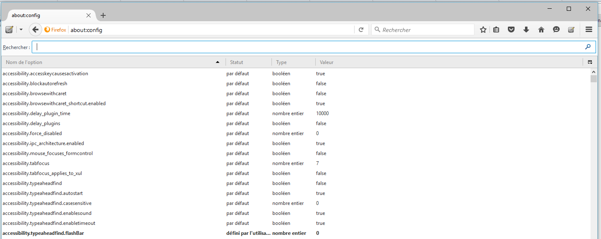
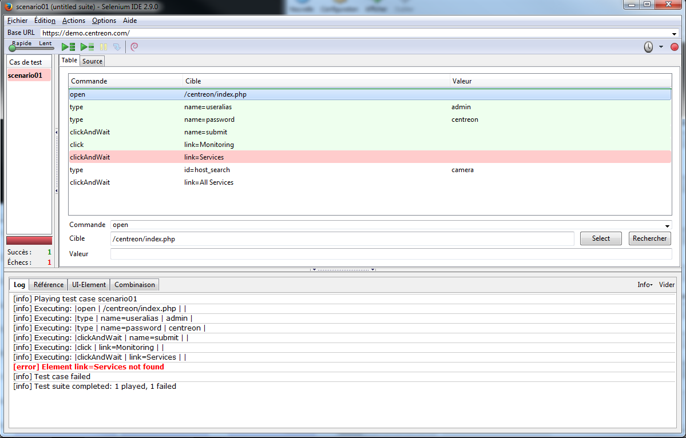

================
Trucs et astuces
================

Comment créer un profil Firefox
===============================

Utilisez Firefox pour créer un profil, cela peut être utile si vous utilisez 
un proxy, des add-ons, ou si vous souhaitez vous authentifier sur des sites 
avec des authentifications particulières (NTLM notamment).

Pour cela ouvrez la fenètre Executer puis taper la commande suivante :

::

  firfox -p

Créer un nouveau profil utilisateur puis cliquez sur "Demarrer Firefox" avec cette utilisateur.
Dans la barre d'adresse entrez la ligne suivante :

:: 

  about:config
  

Enfin, entrez les paramètre suivants pour alléger au maximum votre profil firefox et ainsi éviter 
de faux positif dans votre supervision.

::

  browser.cache.disk.capacity = 0
  browser.cache.disk.enable = false
  browser.cache.disk.smart_size.enabled = false
  browser.cache.memory.enable = false
  browser.cache.offline.enable = false
  app.update.auto = false
  app.update.enabled = false
  app.update.silent = false

Lorsque votre profil est terminé, copiez le dans le répertoire **/etc/default/selenium**
de votre serveur Selenium. Pour que celui-ci soit pris en compte, videz le cache et 
spécifiez le chemin d'accès au profil dans **/etc/default/selenium**.

.. warning:: 
    Vérifier la taille du profil, si celle-ci est trop importante, des performances 
    dégradées sont possibles.
  
Enfin, redémarrez le serveur Selenium pour prendre en compte les modifications.

Désactiver les AddOns et mise-à-jour automatiques
=================================================

Parfois, la mise à jour automatique peut bloquer le navigateur et donc provoquer 
un timeout de votre contrôle. Pour désactiver la fonctionnalité, rendez-vous dans 
**Options > Avancé > Mises à jour** et décochez la case **Installer automatiquement les mises à jours**

Temporiser vos scénarios
========================

Si le site contrôlé subit des problèmes de latence, des "pauses" peuvent être 
ajoutées aux scénarios avec les actions **clickAndWait** ou **waitForPageToLoad**. 
Cela peut éviter les faux positifs sur certaines étapes de vos scénarios.

Fournir des détails en cas d'erreur d'un scénario
=================================================

Quand un scénario échoue, il n'est pas toujours facile de trouver la cause du problème.
Les versions plus récentes du plugin affichent la commande selenium qui a échoué, mais cela n'est pas très lisible.

pour aider à trouver la cause des problèmes, il est possible d'ajouter un texte d'information avant une ou plusieurs commands selenium.
En cas d'erreur, la sonde va afficher la dernière finroamtion qui a été lue dans le scénario.

Cette fonctionnalité peut être utilisée avec la commande selenium "echo".
Voici un exemple de scénario qui échoue :

Sans modification du scénario, la sortie de la sonde sera ::

	CHECKWEB CRITICAL - clickAndWait link=Services  - Execution time = 10.689183s Test Ok 5/8 |'time'=10.689183s;50;60 'availability'=62%;;;0;100

Maintenant, nous pouvons ajouter des informations additionnelles dans le scénario :

Dans ce cas, la sortie de la sonde devient ::

	CHECKWEB CRITICAL - clickAndWait link=Services  - Ouverture services - Execution time = 10.689183s Test Ok 9/11 |'time'=10.689183s;50;60 'availability'=62%;;;0;100

Remarquer l'affichage du texte supplémentaire "Ouverture services", qui correspond à la commande echo du scénario.
